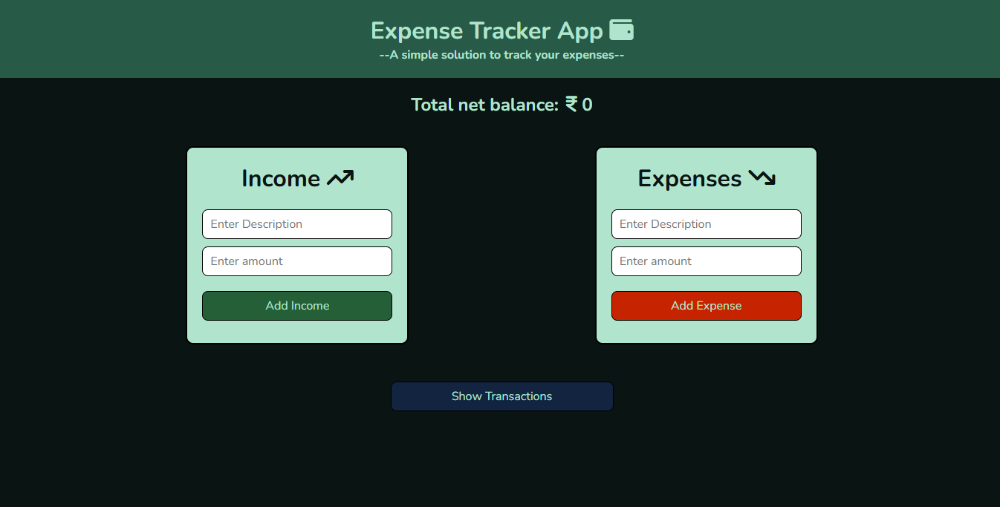
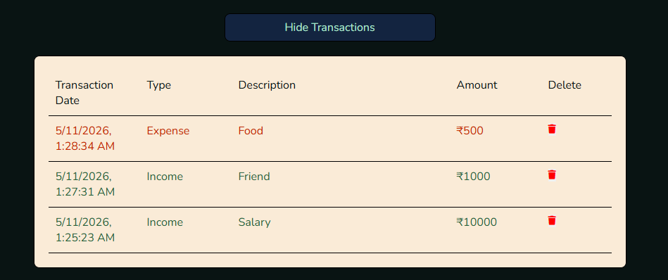
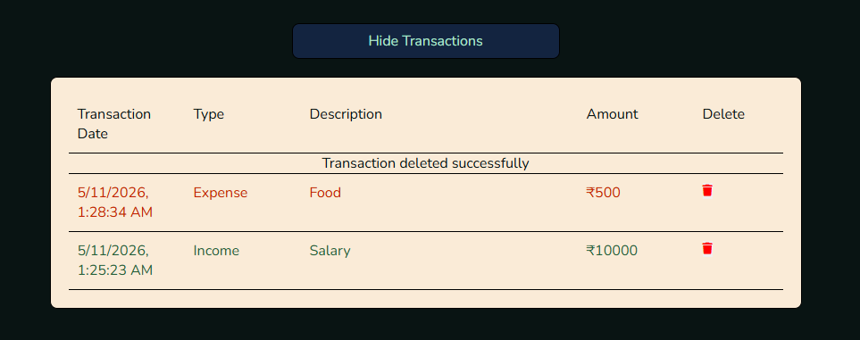
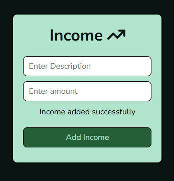
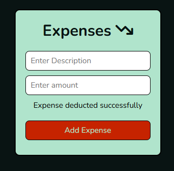
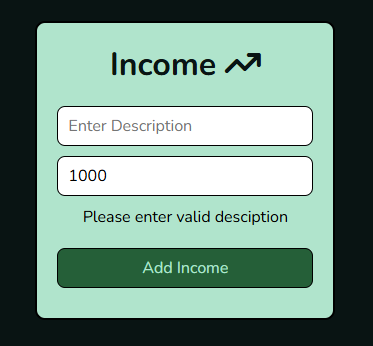
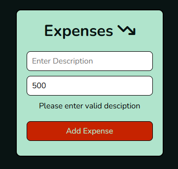
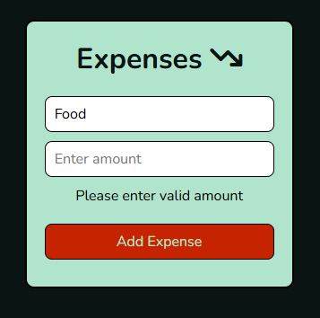

# Expense Tracker App

A responsive Expense Tracker web application built using React.
Users can add income and expense transactions, track their balance, manage transaction history, and store data using local storage.

---

## Features

* Add Income Transactions
* Add Expense Transactions
* Real-time Balance Calculation
* Transaction History
* Delete Transactions
* Local Storage Persistence
* Success & Validation Messages
* Empty State Handling
* Income & Expense Color Differentiation
* Transaction Date Support
* Responsive UI

---

## Tech Stack

* React.js
* JavaScript
* HTML5
* CSS3

---

## Screenshots

### Home Page




### Transaction List






### Validation & Success Messages












---

## Live Demo

Link : Coming soon.

---

## Installation

Clone the repository:

```bash
git clone https://github.com/GauravJha610/expense-tracker-react.git
```

Go to project folder:

```bash
cd frontend-react
```

Install dependencies:

```bash
npm install
```

Run the project:

```bash
npm start
```

---

## Future Improvements In Phase 2

* Backend Integration
* User Authentication
* Database Storage
* Expense Categories
* Charts & Analytics
* Monthly Reports

---

## Author

Gaurav Jha

Built with React as Phase 1 of a full Expense Tracker project.
